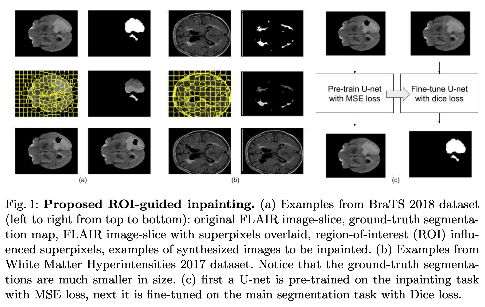
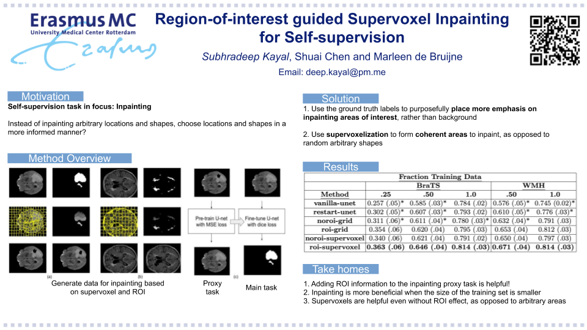

Code the paper titled `Region-of-interest guided Supervoxel Inpainting for Self-supervision` published at MICCAI 2020 (https://arxiv.org/pdf/2006.15186.pdf) by Subhradeep Kayal, et al.



## Citation
If you find this paper useful for your research, please consider citing the paper:

```
@inproceedings{kayal2020region,
  title={Region-of-interest guided Supervoxel Inpainting for Self-supervision},
  author={Kayal, Subhradeep and Chen, Shuai and de Bruijne, Marleen},
  booktitle={International Conference on Medical Image Computing and Computer-Assisted Intervention},
  pages={500--509},
  year={2020},
  organization={Springer}
}
```

## Requirements
1. nibabel
2. keras
3. tensorflow
4. numpy
5. sklearn
6. skimage
7. tqdm
8. cv2


## Steps (to repeat experiments for BraTS 2018)
1. Get BraTS data from https://www.med.upenn.edu/sbia/brats2018/data.html
2. Create a folder within `inpainting` called `data` and put the BraTS data in there, with the folder name `MICCAI_BraTS_2018_Data_Training`. Make sure there is a folder `HGG` in there with the relevant files. We only use the images concerning high grade glioma (HGG) in these experiments.
3. Run `train.sh`
4. Run `evaluate.sh` when the above is finished


### Poster:
